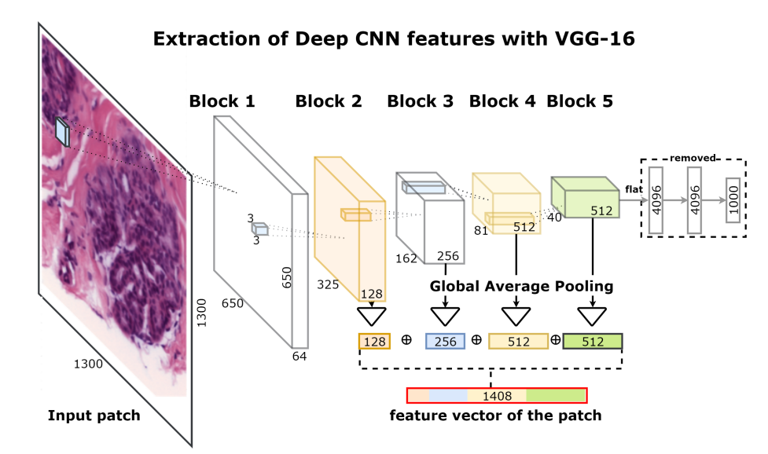

# Breast Cancer Detection

  

## Description

Implementation of Deep Convolutional Neural Networks and Gradient Boosting techniques for breast cancer detection using histopahology images.

Work based on paper [Deep Convolutional Neural Networks for Breast Cancer Histology Image Analysis](https://arxiv.org/abs/1802.00752).

Final project of Computational Intelligence course from Master in Artificial Intelligence degree.

Files:
* [Jupyter noteboook](breast-cancer-detection.ipynb)
* [Report of the project](project-report.pdf)

## Authors

* Lucia Urcelay
* Bernhard Böckenhoff 
* Demetre Dzmanashvili 
* Jakub Glowacz 
